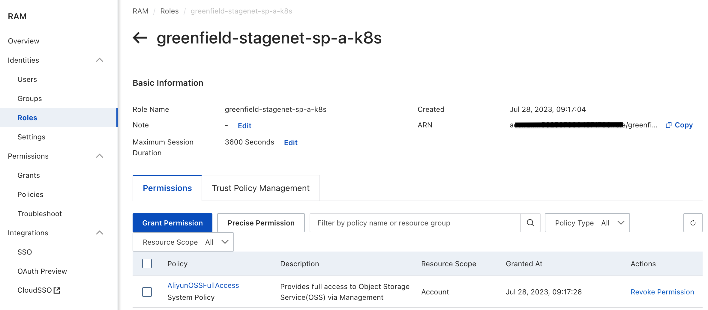
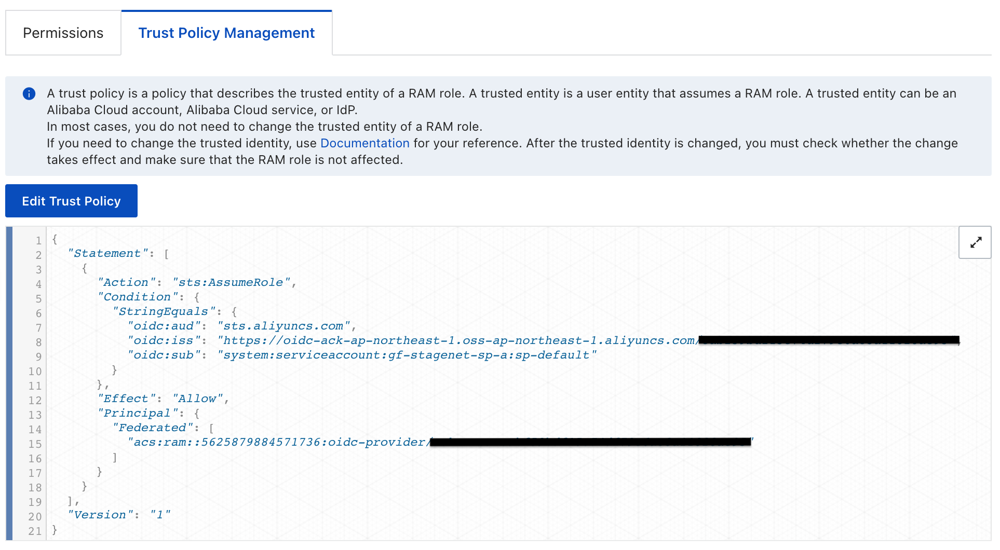
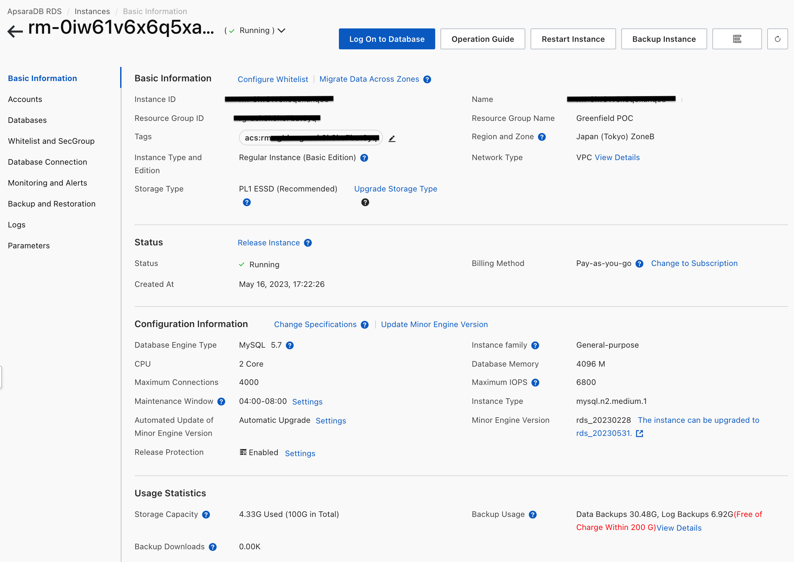
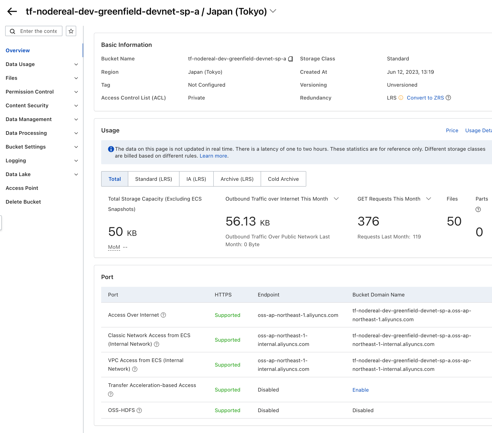

Greenfield Storage Provider Deployment Guide - Alicloud
=======================================================

## Pre-requisites (we assume you already have the following infrastructure):
1. Alicloud account
2. Alicloud ACK already set up

### Resources
#### RAM role

* Create a new role which will be used by SP K8S application.

* Bind K8S service account to this RAM Role

#### Database (RDS)

* Create RDS database and jot down the connection string, username and password.

after RDS created, need to init DB by creating database:
1. storage_provider_db
2. block_syncer
3. block_syncer_backup

#### OSS Bucket

* Create OSS bucket

