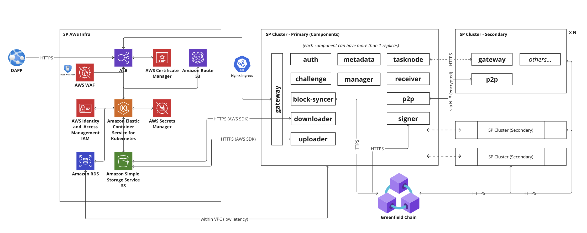
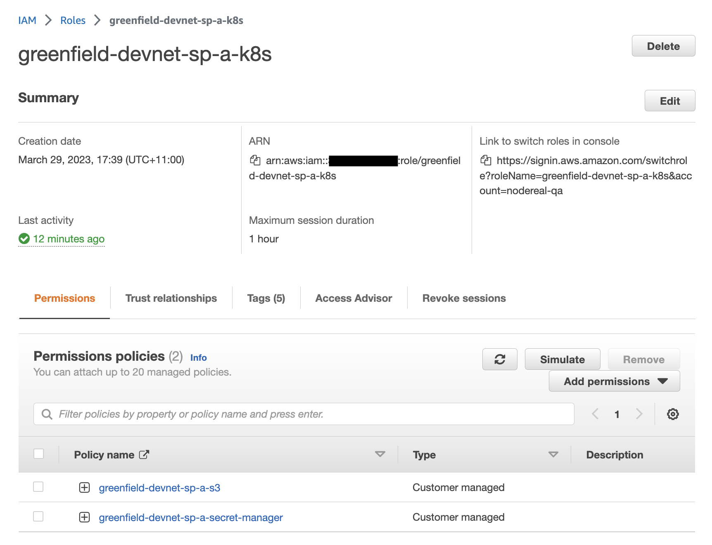
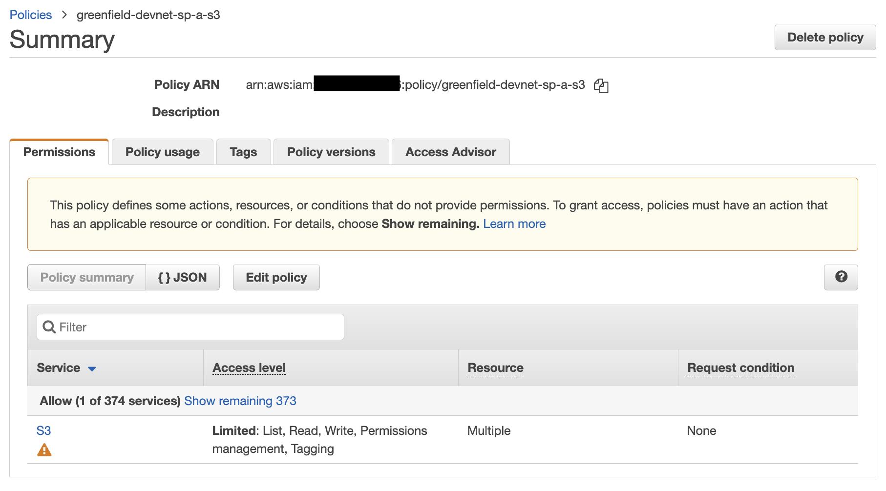
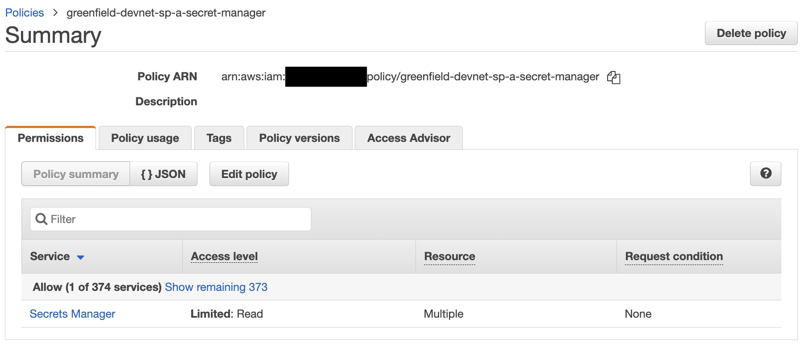
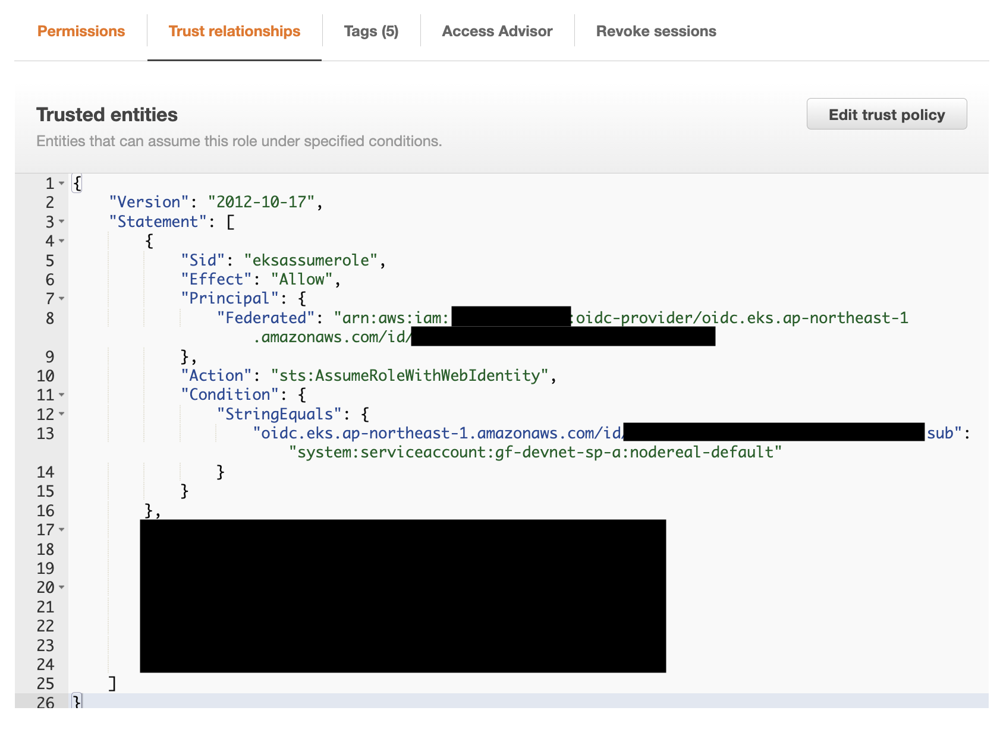
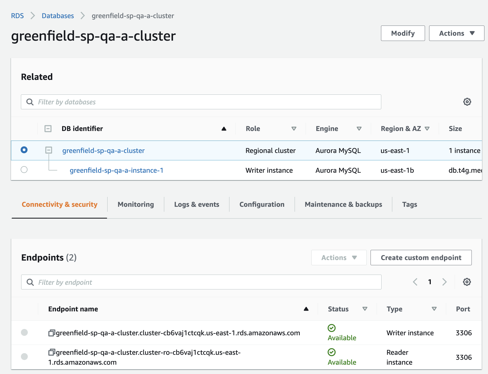
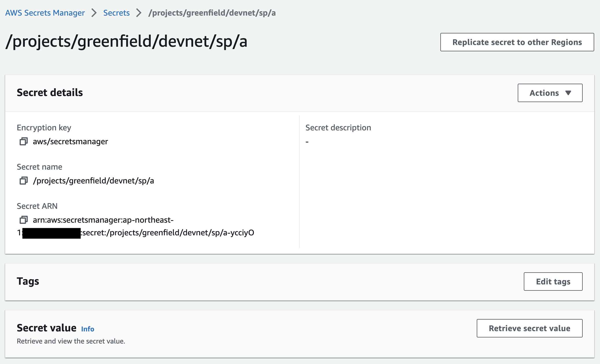

Greenfield Storage Provider Deployment Guide - AWS
==================================================

## Pre-requisites (we assume you already have the following infrastructure):
1. AWS account
2. AWS EKS already set up

## High Level Architecture

### Resources
#### IAM role

* Create a new role which will be used by SP K8S application.

* Add S3 permission policy - This is where SP stores its user uploaded content.

* Add Secret Manager permission policy - K8S will retrieve secret from here as app parameters

* Bind K8S service account to this IAM role

#### Database (RDS)

* Create RDS database and jot down the connection string, username and password.

after RDS created, need to init DB by creating databse:
1. db storage_provider_db
2. db block_syncer
3. db block_syncer_backup

#### S3 Bucket

* Create S3 bucket

#### Secret Manager

* Create secret and update secret value (example provided below)

* For how the secret value should look like, please see examples/aws.

