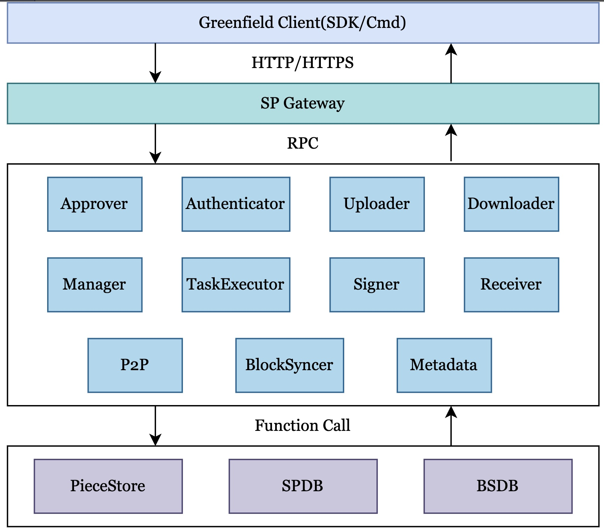

# Overview

## What is the Greenfield Storage Provider

Storage Provider (SP) is infrastructure provider for storage services. They work in synergy with Greenfield validators
to provide a complete storage service. Validators store metadata and financial ledgers with consensus, while SPs store
the actual data (payload data) of objects using the Greenfield chain as the ledger and single source of truth. SPs provide
a range of convenient services for users and dApps to manage data on Greenfield.

## How the Greenfield Storage Providers works

SPs need to register themselves firstly by depositing on the Greenfield blockchain as their "Service Stake". The Greenfield
validators will then conduct a governance procedure to vote to elect the SPs. When joining and leaving the network, SPs
must follow specific actions to ensure data redundancy for users, or they will face fines on their "Service Stake".

SPs provide publicly accessible APIs that allow users to upload, download and manage data. These APIs are designed to be
similar to Amazon S3 APIs, making it easier for existing developers to write code for them. SPs are responsible for 
responding to user requests to write (upload) and read (download) data, as well as managing user permissions and authentications.

Each SP maintains its own local full node, allowing for a strong connection with the Greenfield network. This enables the
SP to directly monitor state changes, properly index data, send transaction requests in a timely manner and manage local data accurately.

To encourage SPs to showcase their capabilities and provide a professional storage system with high-quality SLA, it is
recommended that they advertise their information and prove to the community.

## Architecture

<i>Storage Provider Architecture</i>

SP contains fifteen core modules as show below:

- **Gater**: It serves as the gateway for SP, providing HTTP services and adhering to the S3 protocol. It generates tasks
- corresponding to user requests and forwards them to other modules within SP. Since Gater does not allow customization,
- no interface is defined in the modular file.

- **Authorizer**: It is responsible for verifying authorization.

- **Approver**: It is responsible for handling approval requests, specifically `CreateBucketApproval` and `CreateObjectApproval`.

- **Uploader**: It handles the put object requests from user accounts and stores payload data into piece store of the primary SP.

- **Downloader**: It is responsible for handling get object request from user account and get challenge info request from other components in the Greenfield system.

- **TaskExecutor**: It is responsible for handling background task. This module can request tasks from the Manager module, execute them and report the results or status back to the Manager.

- **Manager**: It is responsible for managing task scheduling of SP and other management functions.

- **P2P**: It is responsible for handling the interaction of control information between SPs. It handles ask replicate piece approval requests by broadcasting the approval to other SPs, waiting for responses and returning the approvals if the minimum or maximum approved number is reached before the timeout.

- **Receiver**: It receives data from the primary SP, calculates the integrity hash of the data, signs it, and returns it to the primary SP for sealing on a greenfield.

- **Signer**: It handles the signing of the SP data on the greenfield chain operator and holds all of the SP's private keys. Due to the sequence number of the SP account, it must be a singleton.

- **Metadata**: It is used to provide efficient query interface for meta info in SP. This module achieves low latency and high-performance SP requirements.

- **BlockSyncer**: It records block in Greenfield blockchain.

- **PieceStore**: It interacts with underlying storage vendors, eg. AWS S3, MinIO, etc.

- **SPDB**: It stores all the contexts of the background jobs and the metadata of SP.

- **BSDB**: It stores all the events' data from the greenfield chain and provides them to the metadata service of SP.

## How to implement customized requirements in Greenfield SP

From the code level, SP is not only an implementation layer, it has been expanded into a framework called `GfSp`, which allows users to customize their own requirements according to their own needs. If users want to implement some specific functions, you can override these methods that are declared in the abstract interfaces. If users don't need to implement customized requirements, `GfSp` will use default implementations. There are nine important layers of abstraction:

- [lifecycle](https://github.com/bnb-chain/greenfield-storage-provider/tree/master/core/lifecycle): It provides two abstract interfaces to manage services lifecycle: register services, start services, listens to the signal and graceful shutdown.
- [module](https://github.com/bnb-chain/greenfield-storage-provider/tree/master/core/module): It provides multiple abstract interfaces to interact with different modules in GfSp. Therefore, users can implement replated methods to meet your own requirements. 
- [consensus](https://github.com/bnb-chain/greenfield-storage-provider/tree/master/core/consensus): It is provides abstract interfaces about how to query data on Greenfield blockchain.
- [piecestore](https://github.com/bnb-chain/greenfield-storage-provider/tree/master/core/piecestore): It is used to interact with underlying storage systems.
- [spdb](https://github.com/bnb-chain/greenfield-storage-provider/tree/master/core/spdb): It provides abstract interfaces about how to store background tasks and metadata of SP.
- [bsdb](https://github.com/bnb-chain/greenfield-storage-provider/blob/master/core/bsdb): It provides abstract interfaces about how to query metadata in SP.
- [rcmgr](https://github.com/bnb-chain/greenfield-storage-provider/tree/master/core/rcmgr): It provides abstract interfaces about managing resources.
- [task](https://github.com/bnb-chain/greenfield-storage-provider/tree/master/core/task): It provides abstract interfaces about the smallest uint for interacting with SP background services.
- [taskqueue](https://github.com/bnb-chain/greenfield-storage-provider/tree/master/core/taskqueue): It provides abstract interfaces about task scheduling and executing.
