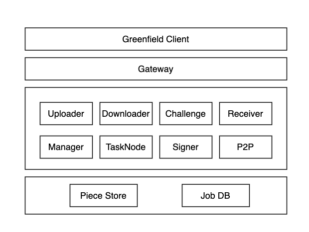

# Overview

## What is the Greenfield Storage Provider

Storage Providers (abbreviated SP) are storage service infrastructures that organizations or individuals provide
and the corresponding roles they play. They use Greenfield as the ledger and the single source of truth. Each SP can and
will respond to users' requests to write (upload) and read (download) data, and serve as the gatekeeper for user rights and
authentications.

// TODO:: change picture
## Architecture

&emsp;

- **Gateway** is the entry point of each SP. It parses requests from the  client and dispatches them to special service.

- **Uploader** receives the object's payload data, splits it into segments, and stores them in piece store.

- **Downloader** handles the user's downloading request and gets object data from the piece store.

- **Receiver** receives data pieces from Primary SP and stores them in the piece store when SP works as a secondary SP.

- **Challenge** handles HA challenge requests and returns the challenged piece data and other pieces' hashes of the object.

- **TaskNode** works as the execute unit, it watches tasks(the smallest unit of a job) and executes them.

- **Manager** responsible for the service management of SP.

- **Signer** signs the transaction messages to the  Greenfield chain with the SP's private key.

- **PieceStore** interacts with underlying storage vendors, eg. AWS S3, MinIO.

- **JobDB** stores all the contexts of the background jobs and the metadata of the SP.
