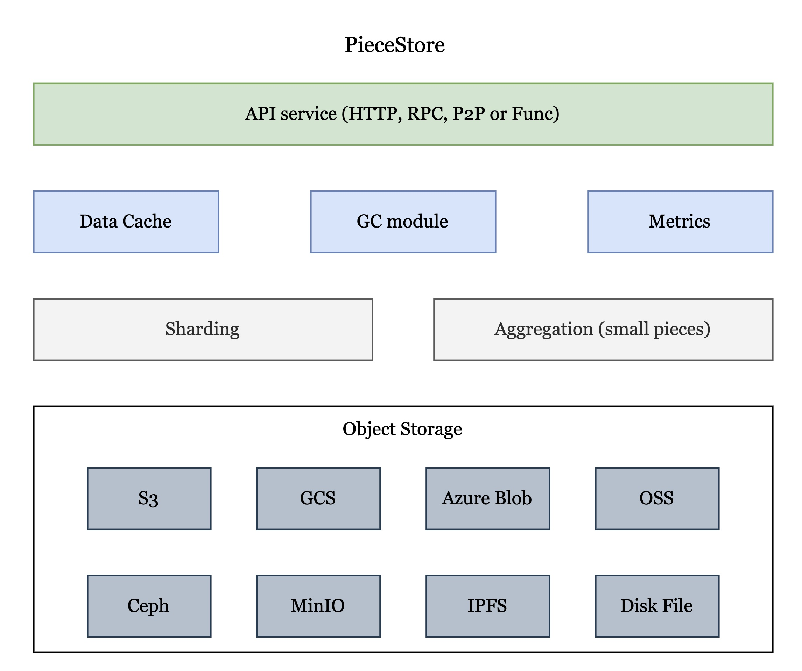

# PieceStore

## Vision

Write once, run on every storage service.

## Goal

- Vendor-agnostic
- Production ready
- High performance
- High availability

## Overview

The core function of PieceStore module is to be compatible with multiple object storage or KV storage such as S3, GCS, Azure Blob, Minio, Ceph, IPFS, DiskFile, Memory, etc. Different SP can use different object storage without caring about the underlying implementation. The PieceStore architecture is shown below:

<div align=center>

</div>

[PieceStore code](https://github.com/bnb-chain/greenfield-storage-provider/tree/master/store/piecestore)

### API service

PieceStore provides encapsulating interfaces for upper-layer services to use.
Now these APIs are called by local pakcage functions. We provide four apis to visit PieceStore as follows:

```go
func (p *PieceStore) Get(ctx context.Context, key string, offset, limit int64) (io.ReadCloser, error)

// Put one piece to PieceStore
func (p *PieceStore) Put(ctx context.Context, key string, reader io.Reader) error

// Delete one piece in PieceStore
func (p *PieceStore) Delete(ctx context.Context, key string) error

// GetPieceInfo returns piece info in PieceStore
func (p *PieceStore) GetPieceInfo(ctx context.Context, key string) (storage.Object, error)
```

In the future, upper-layer services could visit PieceStore through HTTP, RPC or P2P which is more decentralized.

### Sharding

PieceStore provides sharding function for data high availability. PieceStore uses `fnv` algorithm to shard piece data. If users want to use data sharding, you can configure `Shards = a(a is a number which 2 <= a <= 256)` in config.toml.

**Note** The current implementation of sharding can only be used for multiple buckets in one region. The support of multi-region would be added in the future which will be more higher availability.

### Compatibile With Multi Object Storage

PieceStore is vendor-agnostic, so it will be compatibile with multi object storage. Now SP supports based storage such as `S3, MinIO, DiskFile and Memory`.
Recommend using S3 or MinIO in production environment and [the releated config document is here](https://github.com/bnb-chain/greenfield-storage-provider/blob/master/store/piecestore/README.md). Users can experience PieceStore in local by DiskFile or Memory.

### Outlook

PieceStore provides some fundamental functions: wrapped API interfaces, sharding and compatibile with multi object storage. However, there are more functions to be added in the future. 

1. Data Cache

PieceStore is combined with object storage, cache is an important component for interacting efficiently between the local client and remote services. Read and write data can be loaded into cache in advance or asynchronously. Using caching technology can significantly reduce the latency of storag operations and increase data throughput compared to interact with remote services directly.

2. GC Module

There will be some useless data stored in remote object storage which will occupy users' data space and generate extra costs. GC module will garbage useless data according to context. This module will reduce users' data space.
